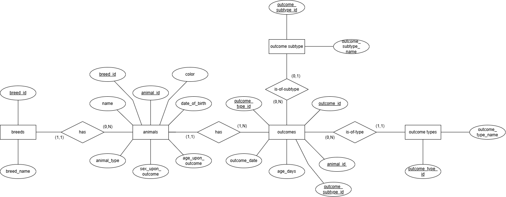
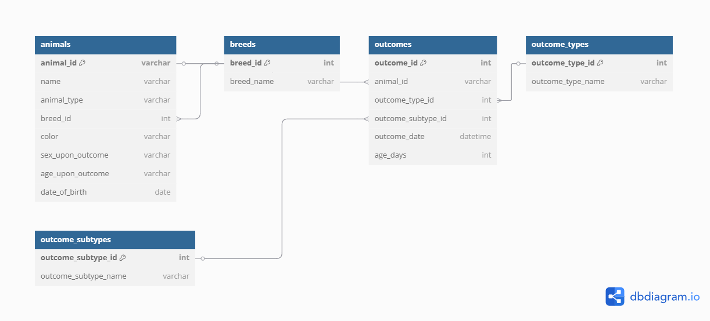
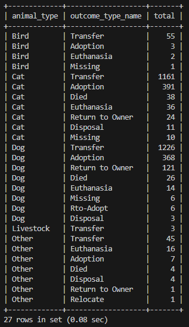
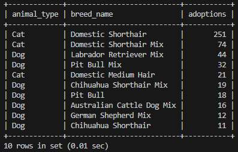
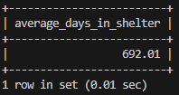
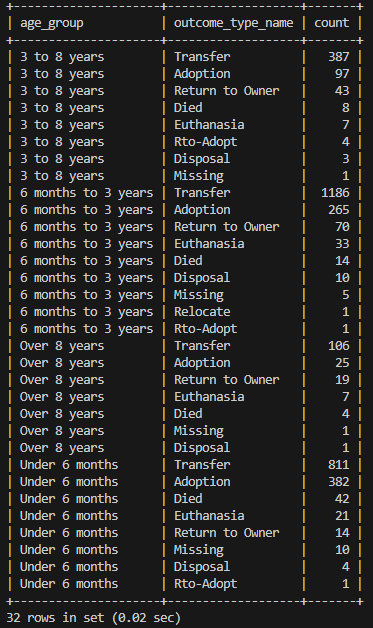
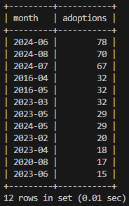

# Austin Animal Center Database System

## Overview

This project designs and implements a relational database for the Austin Animal Center Outcomes dataset.

The project covers the complete database development lifecycle, including dataset analysis, Entity-Relationship (E/R) modelling, relational database normalisation, MySQL implementation, SQL query development, and a simple Node.js web application for querying and visualising the stored data.

---

## Project Objectives

- Analyse and evaluate a real-world open dataset
- Design an Entity-Relationship (E/R) model
- Convert the E/R model into a normalised relational database (3NF)
- Implement the database using MySQL
- Develop SQL queries to answer practical research questions
- Build a simple Node.js web application for interacting with the database

---

## Dataset

This project uses the **Austin Animal Center Outcomes** dataset published by the City of Austin.

Dataset Source:

https://data.austintexas.gov/

A cleaned sample dataset (`animal_clean_sample.csv`) is included in this repository for demonstration and reproducibility.

---

## Research Questions

The database and web application were designed to answer the following questions:

1. What are the most common outcome types for each animal type?
2. Which breeds are adopted most frequently?
3. What is the average shelter stay duration before an outcome?
4. How are outcome types distributed across different age groups?
5. Which months recorded the highest number of adoptions?

---

## Database Design

### Entity Relationship Diagram



### Relational Schema



The database was normalised into Third Normal Form (3NF) to reduce redundancy and improve data integrity.

---

## Web Application

A simple Node.js web application was developed to query the MySQL database and present the results through a browser interface.

The original Node.js source files are no longer available, but screenshots of the application's interface and query results are included below.

### Homepage


### Query 1 — Outcome Types by Animal



### Query 2 — Top Adopted Breeds



### Query 3 — Average Days in Shelter



### Query 4 — Outcome Types by Age Group



### Query 5 — Top Months for Adoption



---

## Technologies Used

- Python
- Pandas
- NumPy
- MySQL
- SQL
- Node.js
- Express.js
- EJS

---

## Repository Structure

```text
austin-animal-center-database/
│
├── README.md
├── LICENSE
├── .gitignore
├── requirements.txt
├── animal-center-database.ipynb
├── animal_clean_sample.csv
│
└── images/
    ├── er-diagram.png
    ├── relational-schema.png
    ├── website-homepage.png
    ├── website-query1.png
    ├── website-query2.png
    ├── website-query3.png
    ├── website-query4.png
    └── website-query5.png
```

---

## How to Run

1. Install the required Python packages.

```bash
pip install -r requirements.txt
```

2. Open the notebook.

```bash
jupyter notebook animal-center-database.ipynb
```

3. Run the notebook to reproduce the data preparation, database design, and SQL analysis.

---

## Future Improvements

Potential future enhancements include:

- Restore and include the original Node.js application source code
- Add interactive charts and dashboards
- Containerise the application using Docker
- Deploy the application to a cloud platform
- Expand the database with additional shelter datasets

---

## Author

**Li Ching**
